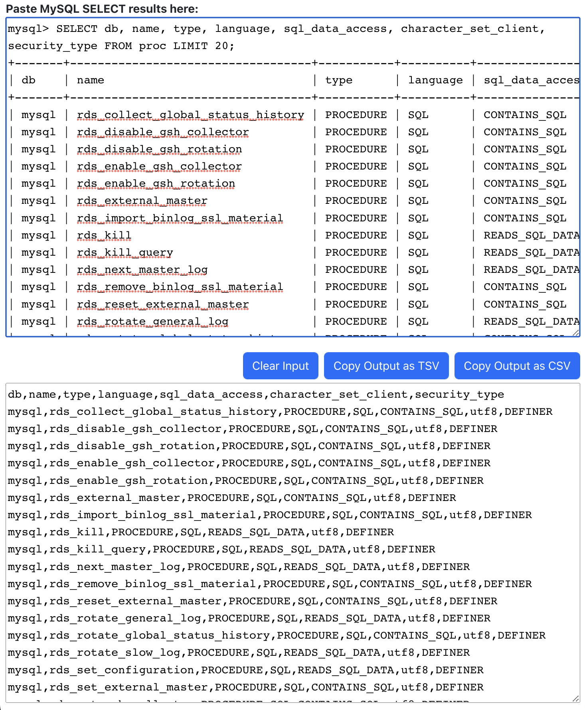

# MySQL to CSV / Output Converter

This React.js App converts the results of a MySQL SELECT query into a CSV or TSV document.

Paste the query output into the top box, and it will automatically render as a CSV in the bottom box. Then do whatever you need to with the transformed result.

## Online access

This project is not currently running on the internet. You will need to clone and run this project locally to access it in a web browser, following the instructions below. Don't worry, it's fast and easy.

## Developer Environment

You must have the following things installed to your developer machine:

* Node (v17 or 18). Use `nvm` to keep multiple installed versions.
* IDE (recommend Visual Studio Code)
* Git Client to run `git` commands
* `make` command installed

### Package Installation

From the project root, run: `make install`

This will install a project-local `node_modules` directory required to run the project. After the initial install, you may need to run `make install` in the future, after merging upstream changes that introduce new packages to the project.

You can also use `make uninstall` and `make reinstall` as needed.

### Running the Project

Once the project is installed, you can run it locally with `make serve`. If you want to install and run in a single step, just use `make install serve`.

Once running, you should be able to access the application in your web browser if it did not auto-launch for you. It usually runs at <http://localhost:3000/> unless you already have something else running on that port.

### Building the Project for Deployment

Run `make build` to have a deployment-ready build created in `ux/build`. You can run `make clean` to remove the `build` directory.
